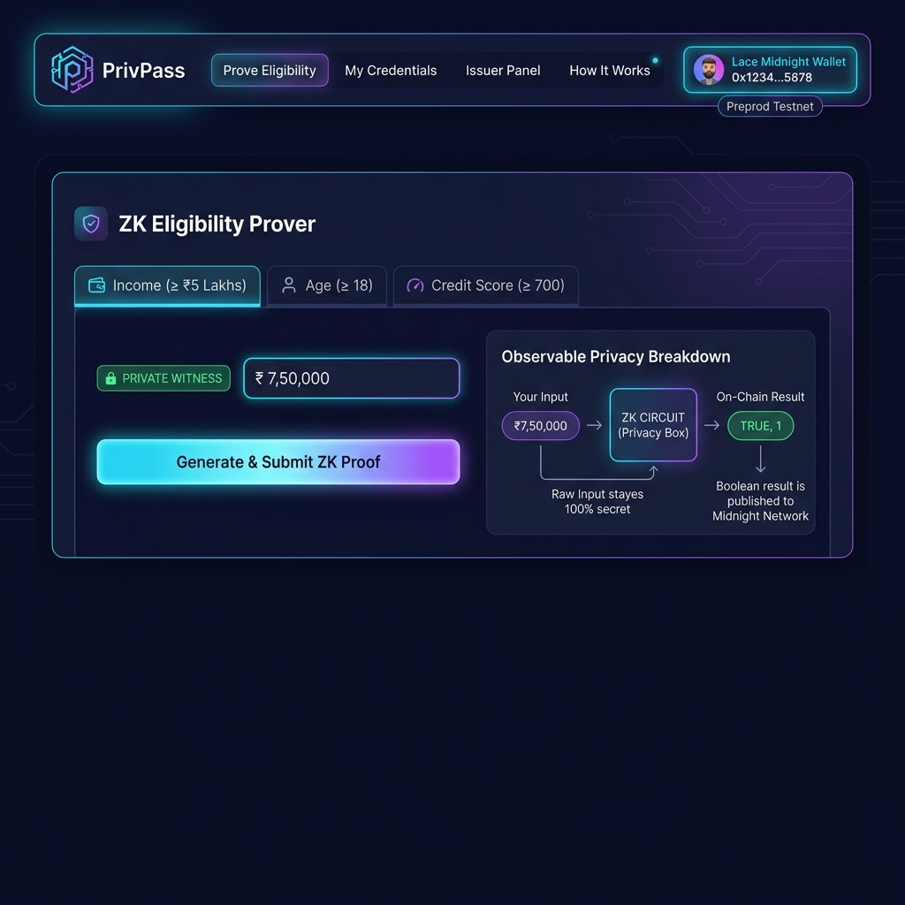
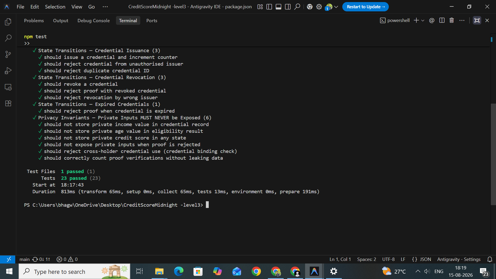

# 🌙 PrivPass – Privacy-Preserving Eligibility Verification

[](https://github.com/harshaljagdale0222/midnight-level3/actions/workflows/ci.yml)

> **Level 3 — First Quarter Submission**  
> **INTO the Midnight SPPU Bootcamp (Rise In)**  
> *Production-grade dApp with tests, CI/CD, and a polished build on Midnight Preprod Network.*

---

## 🎯 Submission Links & Details

| Requirement | Status | Links & Info |
|-------------|--------|--------------|
| **Live Demo URL** | 🌐 **Live** | [midnight-level3-frontend.vercel.app](https://midnight-level3-frontend.vercel.app) |
| **Demo Video (Loom)** | 🎥 **Recorded** | [Watch Full Demo on Loom](https://www.loom.com/share/0fa0b88fd30740a8b6c6ab596ec5565a) |
| **Deployed Contract** | ✅ Verified | `02008f5a91724a73e4b70db64e43e2e8e94553b9bf1335c024d0ad42398bf234` |
| **GitHub Commits** | ✅ 25+ | Full version history available in repo |

---

## 🖥️ UI & Testing Previews

### 1. Frontend DApp


### 2. Vitest Execution (23 Passing)


---

## ✨ Key Features & Privacy Model

PrivPass acts as an **Eligibility Gate** using Midnight's ZK Proofs. It allows users to prove they meet requirements (like Income or Age) without revealing their actual sensitive data.

- **✅ Wallet Integration:** Full DApp connector API integration (`window.midnight.mnLace`).
- **✅ ZK Circuits:** Compact ZK circuits (`proveIncome`, `proveAge`) invoked from the browser.
- **✅ 100% Local Privacy:** Sensitive data (e.g., ₹6,00,000 income) stays inside your browser RAM.
- **✅ On-Chain Safety:** Midnight ledger ONLY records a simple boolean (`passed: true/false`).

---

## 🛠️ Technical Details (Click to Expand)

<details>
<summary><b>🔒 Observable Privacy: "Proven Without Being Shown"</b></summary>

### The Architecture
```text
┌─────────────────────────────────────────────────────────────────────────────┐
│                       LOCAL BROWSER WITNESS (PRIVATE)                      │
│   • actualIncome = 600 (₹6,00,000)                                          │
│   • privateSalt  = 0x4a8f9c...                                              │
└──────────────────────────────────────┬──────────────────────────────────────┘
                                       │ Local Witness (Never leaves browser)
                                ┌──────▼──────┐
                                │ ZK Circuit  │  (Groth16) evaluates: (actualIncome >= 500)
                                └──────┬──────┘
                                       │ Proof + Disclosed Boolean
┌──────────────────────────────────────▼──────────────────────────────────────┐
│                    MIDNIGHT PREPROD LEDGER (PUBLIC STATE)                   │
│   • eligibilityResults = { passed: true } <-- ONLY BOOLEAN RECORDED         │
└─────────────────────────────────────────────────────────────────────────────┘
```

### What Indexers CAN vs CANNOT See:
- ✅ **Can See:** Boolean outcome (`passed: true`), Wallet Address, Timestamp.
- ❌ **Cannot See:** Actual Income, Age, Blinding Salts, or raw credential data.
</details>

<details>
<summary><b>💻 Local Development Setup</b></summary>

### Prerequisites
- Node.js ≥ 20, npm ≥ 10, Git, Docker Desktop
- Compact CLI

### Quick Start
```bash
git clone https://github.com/harshaljagdale0222/midnight-level3.git
cd midnight-level3
npm install
npm run setup
```

### Run Tests & Compile
```bash
npm run compile
npm test
```

### Frontend Server
```bash
cd frontend
npm install
npm run dev
# Open http://localhost:5173
```
</details>

<details>
<summary><b>⚙️ Tech Stack & Future Scope</b></summary>

**Tech Stack:**
- **Smart Contract:** Compact (Midnight native)
- **Blockchain:** Midnight Preprod
- **Frontend:** React 19 + Vite 5 + TypeScript
- **Testing & CI:** Vitest, Vercel

**Future Scope:**
- Mainnet Deployment
- Identity Credential Circuit (Government IDs)
- Multi-threshold Proofs & Composite Eligibility
- DID Integration (W3C)
</details>

---
*Built for the INTO the Midnight — SPPU Bootcamp (Rise In), 2026.*